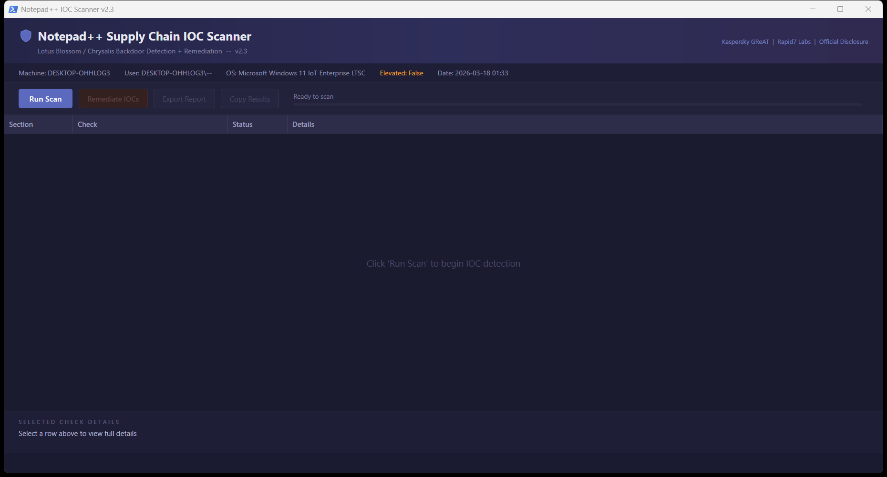

# Notepad++ Supply Chain IOC Scanner

Comprehensive IOC scanner for the **Notepad++ supply chain compromise** (June-December 2025) attributed to the Chinese APT group **Lotus Blossom** (aka Billbug, Raspberry Typhoon, Spring Dragon).

The attack hijacked the WinGUp update mechanism via hosting provider compromise to deliver the **Chrysalis backdoor**, Cobalt Strike beacons, and Metasploit payloads to targeted organizations.




## Quick Start

**One-line run** (Run as Administrator in PowerShell):

```powershell
irm https://raw.githubusercontent.com/SysAdminDoc/npp-sc-scanner/refs/heads/main/NppScanner-GUI.ps1 | iex
```

## Scripts

| Script | Description |
|--------|-------------|
| `Check-NotepadPlusPlusIOC.ps1` | **CLI scanner** - Ideal for RMM deployment (ConnectWise, Datto, NinjaRMM, etc.) |
| `Check-NotepadPlusPlusIOC-GUI.ps1` | **GUI scanner + remediator** - Interactive WPF interface for technicians |

## Features

### Detection Coverage

- **Notepad++ version analysis** - Pre-8.8.9 = vulnerable, pre-8.9.1 = partially patched
- **Malware staging directories** - `%APPDATA%\ProShow`, `%APPDATA%\Bluetooth`
- **Hidden attribute detection** - Chrysalis NSIS installer sets Hidden on Bluetooth directory
- **41 file hashes** - 25 SHA-1 (Kaspersky) + 16 SHA-256 (Rapid7)
- **8 C2 IP addresses** - Malicious update hosts and C2 servers
- **6 C2 domains** - Including api.skycloudcenter.com, wiresguard.com
- **Cobalt Strike artifacts** - In `ProgramData\USOShared`
- **Persistence mechanisms** - Registry Run keys (incl. WOW6432Node), services, scheduled tasks
- **Running processes** - BluetoothService, ProShow, ConsoleApplication2, fake svchost
- **Network connections** - Active C2 connections, DNS cache entries
- **GUP.exe monitoring** - Connections to non-legitimate update sources
- **Hosts file tampering** - notepad-plus-plus.org redirections
- **Chrysalis mutex** - `Global\Jdhfv_1.0.1`
- **AutoUpdate.exe** - Not a legitimate Notepad++ file

### RMM/MSP Features (CLI)

- **SYSTEM account support** - Automatically enumerates ALL user profiles when running as NT AUTHORITY\SYSTEM
- **Exit codes** - `0` = clean, `1` = IOCs found (for RMM alerting)
- **Export to file** - `-ExportPath` parameter for compliance documentation
- **HKU registry access** - Checks HKEY_USERS for loaded user hives when running as SYSTEM

### GUI Features

- **Dark-themed WPF interface** - Professional appearance
- **Real-time scanning** - Progress bar and status updates
- **One-click remediation** - Kill processes, delete files, clean registry, block C2 IPs
- **Export/Copy reports** - Text and CSV formats
- **Source links** - Direct links to Kaspersky, Rapid7, and official disclosure

## Usage

### CLI (RMM Deployment)

```powershell
# Basic scan
.\Check-NotepadPlusPlusIOC.ps1

# Export report
.\Check-NotepadPlusPlusIOC.ps1 -ExportPath "C:\Reports\npp-scan.txt"

# RMM integration with exit code check
.\Check-NotepadPlusPlusIOC.ps1 -ExportPath "C:\Logs\npp-scan.txt"
if ($LASTEXITCODE -eq 1) {
    # Alert: IOCs detected
}
```

### GUI

```powershell
.\Check-NotepadPlusPlusIOC-GUI.ps1
```

Or right-click > "Run with PowerShell"

## RMM Deployment Notes

When deploying via RMM tools (ConnectWise Automate, Datto RMM, NinjaRMM, etc.), the script runs as `NT AUTHORITY\SYSTEM`. Version 2.3+ automatically handles this by:

1. Detecting SYSTEM execution context
2. Enumerating all user profiles via `HKLM:\SOFTWARE\Microsoft\Windows NT\CurrentVersion\ProfileList`
3. Checking each user's `%APPDATA%` and `%LOCALAPPDATA%` paths
4. Accessing user registry hives via `HKU:\{SID}\...` instead of `HKCU:`

**Previous versions (pre-2.3) would miss user-profile IOCs when running as SYSTEM.**

## False Positive Notes

### `C:\ProgramData\USOShared`
This is a **legitimate Windows Update directory** (Update Session Orchestrator). The scanner only flags this directory if it contains specific malicious artifacts (`svchost.exe`, `conf.c`, `libtcc.dll`), not for mere existence.

### `temp.sh` in DNS cache
`temp.sh` is a legitimate anonymous file-sharing service that was used for data exfiltration in this campaign. DNS cache hits for `temp.sh` on developer workstations may be false positives. Investigate context before taking action.

### `%APPDATA%\Adobe\Scripts`
May be a legitimate Adobe directory. Only flagged if it contains `alien.ini` malware configuration.

## Remediation (GUI Only)

The GUI provides automated remediation that:

1. **Kills malicious processes** - BluetoothService, ProShow, ConsoleApplication2, fake svchost
2. **Removes malware directories** - `%APPDATA%\ProShow`, `%APPDATA%\Bluetooth`
3. **Deletes specific malware files** - Including files in legitimate directories
4. **Cleans registry persistence** - Run keys including WOW6432Node
5. **Removes BluetoothService service** - If present
6. **Unregisters malicious scheduled tasks**
7. **Creates firewall rule** - Blocks outbound to all known C2 IPs (requires elevation)

> **Important:** Export the report BEFORE remediating to preserve forensic evidence.

## Post-Remediation Steps

1. Update Notepad++ to v8.9.1+ via manual download from [GitHub releases](https://github.com/notepad-plus-plus/notepad-plus-plus/releases)
2. Block `gup.exe` internet access via firewall or route updates through internal repository
3. Rotate credentials on affected machines
4. Check other machines with Notepad++ installed
5. Review logs for lateral movement indicators
6. Engage incident response team if confirmed compromise

## Sources

- **Kaspersky GReAT**: [Notepad++ Supply Chain Attack Analysis](https://securelist.com/notepad-supply-chain-attack/118708/)
- **Rapid7 Labs**: [Chrysalis Backdoor Deep Dive](https://www.rapid7.com/blog/post/tr-chrysalis-backdoor-dive-into-lotus-blossoms-toolkit/)
- **Notepad++ Official**: [Hijacked Incident Info Update](https://notepad-plus-plus.org/news/hijacked-incident-info-update/)

## Requirements

- PowerShell 5.1+ (included in Windows 10/11, Server 2016+)
- Windows 10/11 or Windows Server 2016+
- GUI requires WPF (.NET Framework, included in Windows)
- Administrator/elevation recommended for full detection capabilities

## Version History

| Version | Date | Changes |
|---------|------|---------|
| 2.3 | 2026-02-04 | SYSTEM account profile enumeration for RMM deployment; WOW6432Node registry coverage; Hidden attribute detection; Exit codes; temp.sh FP note; Bug fixes |
| 2.2 | 2026-02-04 | USOShared false positive fix; Adobe\Scripts smart detection |
| 2.1 | 2026-02-03 | Hidden Bluetooth directory detection |
| 2.0 | 2026-02-02 | GUI remediator; comprehensive IOC coverage |
| 1.0 | 2026-02-01 | Initial release 
